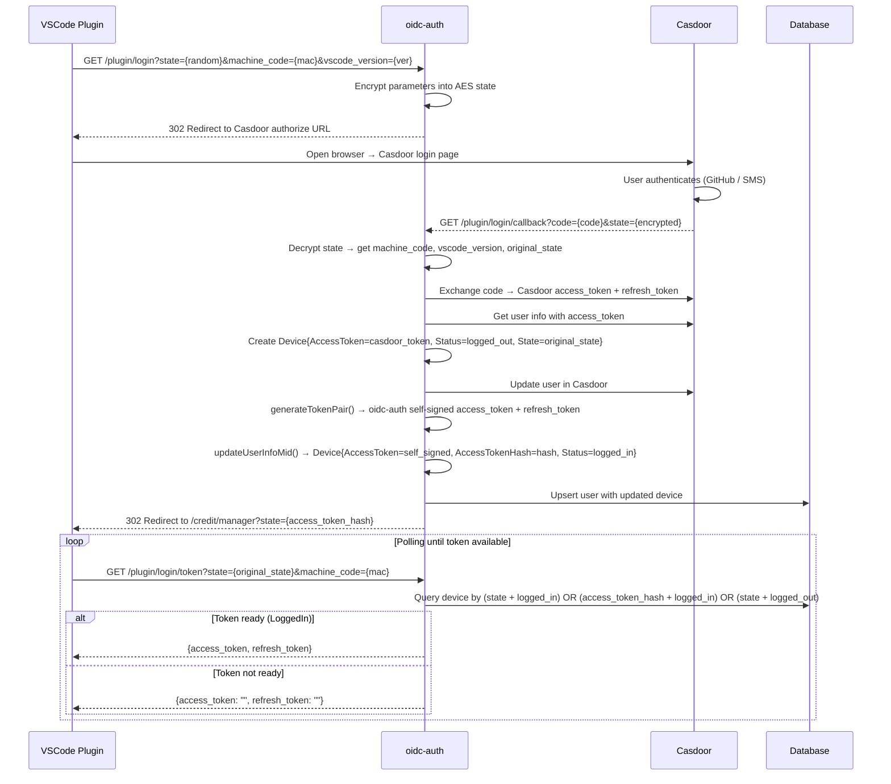
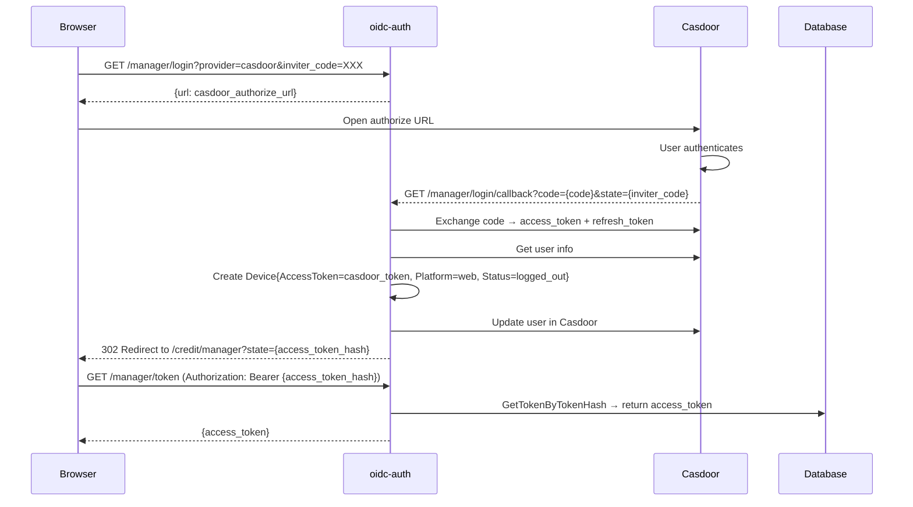
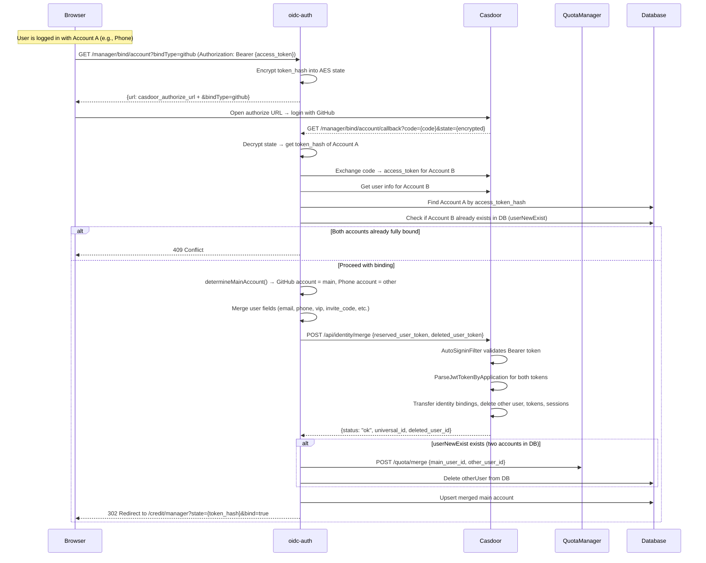
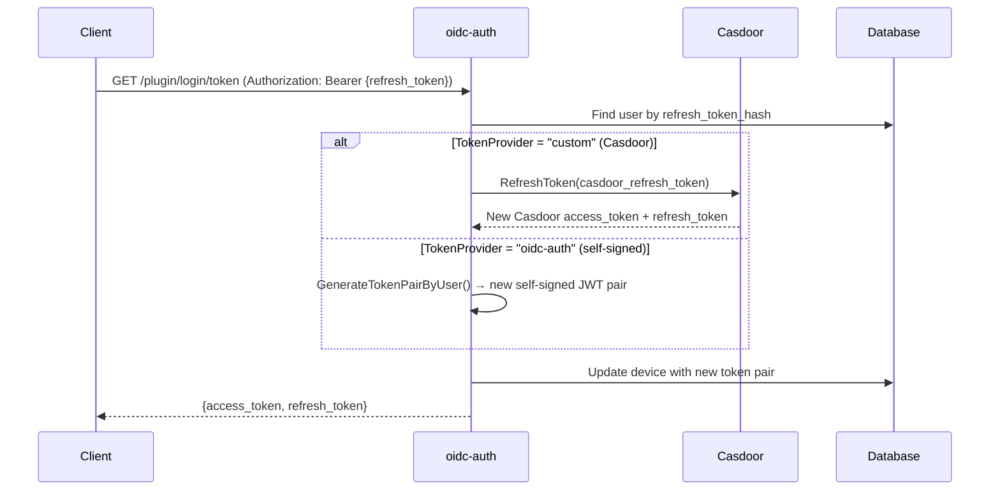

# OIDC Authentication Server

[](https://golang.org/)
[](LICENSE)
[](Dockerfile)

A modern OIDC authentication server based on Casdoor, providing enterprise-grade user authentication and authorization services.

## ✨ Features

- 🔐 **OIDC Standard Authentication** - Secure authentication based on OpenID Connect protocol
- 🌟 **GitHub Integration** - Support for GitHub Star synchronization and user association
- 📱 **SMS Verification** - Integrated SMS service with verification code support
- 🗄️ **Multi-Database Support** - Compatible with MySQL 8.0+ and PostgreSQL 13+
- 🐳 **Containerized Deployment** - Complete Docker and Kubernetes support
- ⚡ **High Performance** - Optimized connection pooling and concurrent processing
- 🛡️ **Security Middleware** - Complete security headers and request logging

## 🚀 Quick Start

### Requirements

- Go 1.23.0+
- MySQL 8.0+ or PostgreSQL 13+
- Docker (optional)

### Local Development

1. **Clone the Repository**
```bash
git clone https://github.com/zgsm-ai/oidc-auth.git
cd oidc-auth
```

2. **Install Dependencies**
```bash
go mod tidy
```

3. **Configure**
```bash
cp config/config.yaml config/config.yaml.local
# Edit the configuration file with your actual settings
```

4. **Run the Service**
```bash
go run cmd/main.go serve --config config/config.yaml
```

The service will start at `http://localhost:8080`.

### Docker Deployment

1. **Build Image**
```bash
docker build -t oidc-auth:latest .
```

2. **Run Container**
```bash
docker run -d \
  --name oidc-auth \
  -p 8080:8080 \
  -e SERVER_BASEURL="<server_base_url>" \
  -e PROVIDERS_CASDOOR_CLIENTID="<casdoor_client_id>" \
  -e PROVIDERS_CASDOOR_CLIENTSECRET="<casdoor_client_secret>" \
  -e PROVIDERS_CASDOOR_BASEURL="<casdoor_base_url>" \
  -e PROVIDERS_CASDOOR_INTERNALURL="<casdoor_base_url>" \
  -e SMS_ENABLEDTEST="false" \
  -e SYNCSTAR_ENABLED="false" \
  -e DATABASE_HOST="<database_host>" \
  -e DATABASE_PASSWORD="<database_password>" \
  -e ENCRYPT_AESKEY="<aes_key>" \
  oidc-auth:latest
```

## ⚙️ Configuration

### Environment Variables

Complete environment variable configuration for containerized deployment:

| Category                    | Environment Variable | Description | Default Value |
|-----------------------------|---------------------|-------------|---------------|
| **Server Configuration**    | `SERVER_SERVERPORT` | Service port | `8080` |
|                             | `SERVER_BASEURL` | Service base URL | `http://localhost:8080` |
|                             | `SERVER_ISPRIVATE` | Private network mode | `false` |
| **Authentication Provider** | `PROVIDERS_CASDOOR_CLIENTID` | Casdoor client ID | - |
|                             | `PROVIDERS_CASDOOR_CLIENTSECRET` | Casdoor client secret | - |
|                             | `PROVIDERS_CASDOOR_BASEURL` | Casdoor service address | - |
|                             | `PROVIDERS_CASDOOR_INTERNALURL` | Casdoor service internal address |-|
| **Database Configuration**  | `DATABASE_TYPE` | Database type | `postgres` |
|                             | `DATABASE_HOST` | Database host | `localhost` |
|                             | `DATABASE_PORT` | Database port | `5432` |
|                             | `DATABASE_USERNAME` | Database username | `postgres` |
|                             | `DATABASE_PASSWORD` | Database password | - |
|                             | `DATABASE_DBNAME` | Database name | `auth` |
|                             | `DATABASE_MAXIDLECONNS` | Max idle connections | `50` |
|                             | `DATABASE_MAXOPENCONNS` | Max open connections | `300` |
| **SMS Service**             | `SMS_ENABLEDTEST` | Test mode | `true` |
|                             | `SMS_CLIENTID` | SMS client ID | - |
|                             | `SMS_CLIENTSECRET` | SMS client secret | - |
|                             | `SMS_TOKENURL` | Token endpoint | - |
|                             | `SMS_SENDURL` | SMS send endpoint | - |
| **GitHub Sync**             | `SYNCSTAR_ENABLED` | Enable Star sync | `true` |
|                             | `SYNCSTAR_PERSONALTOKEN` | GitHub Personal Token | - |
|                             | `SYNCSTAR_OWNER` | Repository owner | `zgsm-ai` |
|                             | `SYNCSTAR_REPO` | Repository name | `zgsm` |
|                             | `SYNCSTAR_INTERVAL` | Sync interval (minutes) | `1` |
| **Encryption**              | `ENCRYPT_AESKEY` | AES key (32 characters) | - |
|                             | `ENCRYPT_ENABLERSA` | Enable RSA | `false` |
|                             | `ENCRYPT_PRIVATEKEY` | RSA private key file path | `config/private.pem` |
|                             | `ENCRYPT_PUBLICKEY` | RSA public key file path | `config/public.pem` |
| **Quota Manager**           | `QUOTAMANAGER_BASEURL` | QuotaManager service base URL | - |
| **Logging**                 | `LOG_LEVEL` | Log level | `info` |
|                             | `LOG_FILENAME` | Log file path | `logs/app.log` |
|                             | `LOG_MAXSIZE` | Log file size limit (MB) | `100` |
|                             | `LOG_MAXBACKUPS` | Number of backup files | `10` |
|                             | `LOG_MAXAGE` | Log retention days | `30` |
|                             | `LOG_COMPRESS` | Compress old logs | `true` |

## Kubernetes Deployment

```bash
cp ./charts/oidc-auth/values.yaml /your/path/values.yaml
# modify /your/path/values.yaml
helm install -n oidc-auth oidc-auth ./charts/oidc-auth \
  --set replicaCount=1 \
  --set autoscaling.enabled=true \
  --set resources.requests.memory=512Mi \
  --create-namespace \
  -f /your/path/values.yaml
```

## Architecture

### System Overview

oidc-auth acts as a middleware between clients (VSCode plugin / Web browser) and Casdoor (OIDC identity provider). It manages two types of tokens:

| Token | Issuer | Purpose | Verified By |
|-------|--------|---------|-------------|
| **Casdoor Access Token** | Casdoor | Calling Casdoor APIs (merge account, refresh token, get user info) | Casdoor (`token` table + JWT) |
| **oidc-auth Access Token** | oidc-auth (self-signed JWT, RS256) | Client ↔ oidc-auth authentication | oidc-auth (public key or `access_token_hash` in DB) |

### Data Model

```
AuthUser
├── ID (UUID, PK)
├── Name, Email, Phone, GithubID, GithubName ...
├── InviteCode, InviterID
└── Devices[] (JSONB)
    └── Device
        ├── MachineCode, VSCodeVersion, Platform
        ├── AccessToken / AccessTokenHash       ← oidc-auth self-signed token
        ├── RefreshToken / RefreshTokenHash      ← oidc-auth self-signed refresh token
        ├── State                                ← OAuth state for login polling
        ├── Status (logged_out / logged_in / logged_offline)
        └── TokenProvider ("custom" = Casdoor, "oidc-auth" = self-signed)
```

### Plugin Login Flow



#### `firstGetToken` Query Strategy

The plugin polls `login/token` with the original `state` parameter. `firstGetToken` tries three queries in order:

| Priority | Query Conditions | Scenario |
|----------|-----------------|----------|
| 1 | `access_token_hash=state` + `status=LoggedIn` | Web callback redirects with `access_token_hash` as state |
| 2 | `state=state` + `status=LoggedIn` | Plugin callback completed, device is logged in |
| 3 | `state=state` + `status=LoggedOut` | Callback not yet completed, generate token on the fly |

If none match, returns empty token (plugin continues polling).

### Web Login Flow



### Account Binding Flow

Account binding merges two identities (e.g., GitHub account + Phone account) into one. The GitHub account always becomes the main account.



#### `determineMainAccount` Strategy

| Scenario | Main Account | Other Account |
|----------|-------------|---------------|
| Binding account not in DB | Current user (userOld) | New OAuth user (userNew) |
| Binding account exists, has GitHub | Existing account (userNewExist) | Current user (userOld) |
| Binding account exists, no GitHub | Current user (userOld) | Existing account (userNewExist) |

#### Casdoor `/api/identity/merge` Interaction

oidc-auth calls Casdoor's merge API with:

- **Request Header**: `Authorization: Bearer {mainToken}` (Casdoor access token of the reserved user)
- **Request Body**: `{"reserved_user_token": "{mainToken}", "deleted_user_token": "{otherToken}"}`
- **Casdoor Processing**:
  1. `AutoSigninFilter` validates the Bearer token against the `token` table
  2. `MergeUsers()` parses both JWTs, verifies ownership
  3. Transfers identity bindings from deleted user to reserved user
  4. Deletes the other user's tokens, sessions, and user record

> **Note**: The tokens passed to Casdoor must be valid Casdoor access tokens that exist in Casdoor's `token` table. If the token has expired or been cleaned up, the `AutoSigninFilter` will reject the request with "Access token doesn't exist in database".

### Token Refresh Flow



### API Endpoints

| Endpoint | Method | Description |
|----------|--------|-------------|
| `/oidc-auth/api/v1/plugin/login` | GET | Initiate plugin OAuth login |
| `/oidc-auth/api/v1/plugin/login/callback` | GET | Plugin OAuth callback |
| `/oidc-auth/api/v1/plugin/login/token` | GET | Get/refresh plugin token |
| `/oidc-auth/api/v1/plugin/login/logout` | GET | Logout plugin |
| `/oidc-auth/api/v1/plugin/login/status` | GET | Check login status |
| `/oidc-auth/api/v1/manager/login` | GET | Initiate web OAuth login |
| `/oidc-auth/api/v1/manager/login/callback` | GET | Web OAuth callback |
| `/oidc-auth/api/v1/manager/login/callback/:service` | GET | Web OAuth callback with custom redirect |
| `/oidc-auth/api/v1/manager/token` | GET | Get token by access_token_hash |
| `/oidc-auth/api/v1/manager/userinfo` | GET | Get current user info |
| `/oidc-auth/api/v1/manager/bind/account` | GET | Initiate account binding |
| `/oidc-auth/api/v1/manager/bind/account/callback` | GET | Account binding callback |
| `/oidc-auth/api/v1/manager/invite-code` | GET | Get user invite code |
| `/oidc-auth/api/v1/send/sms` | POST | Send SMS verification code |
| `/health/ready` | GET | Health check |

## License

This project is licensed under the MIT License - see the [LICENSE](LICENSE) file for details.

## Contributing

Issues and Pull Requests are welcome!

### Contribution Guidelines
1. Fork the project
2. Create a feature branch
3. Commit your changes
4. Push to the branch
5. Create a Pull Request

## Support

If you have any questions or suggestions, please create an [Issue](https://github.com/zgsm-ai/oidc-auth/issues).