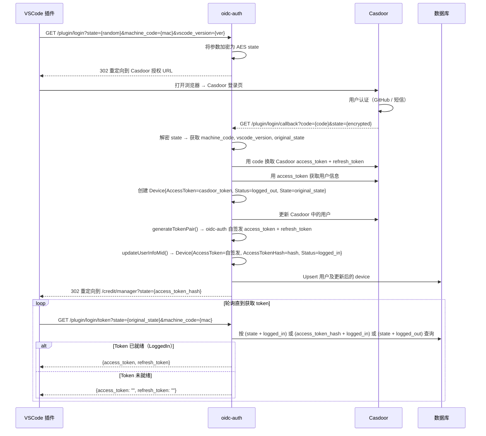
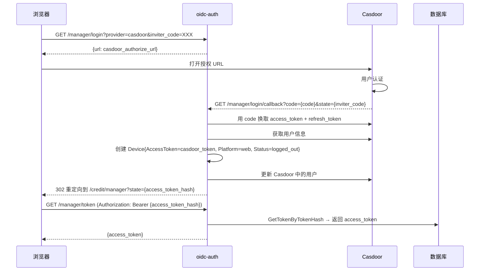
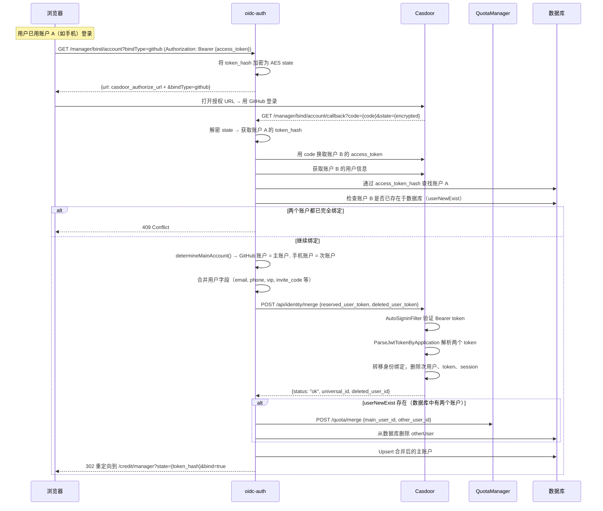
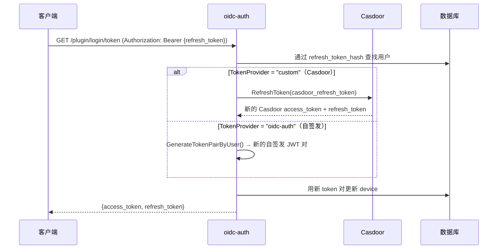

# OIDC Authentication Server

[](https://golang.org/)
[](LICENSE)
[](Dockerfile)

一个基于 Casdoor 的现代化 OIDC 认证服务器，提供企业级用户认证和授权功能。

## ✨ 功能特性

- 🔐 **OIDC 标准认证** - 基于 OpenID Connect 协议的安全认证
- 🌟 **GitHub 集成** - 支持 GitHub Star 同步和用户关联
- 📱 **短信验证** - 集成短信服务，支持验证码发送
- 🗄️ **多数据库支持** - 兼容 MySQL 8.0+ 和 PostgreSQL 13+
- 🐳 **容器化部署** - 完整的 Docker 和 Kubernetes 支持
- ⚡ **高性能** - 优化的连接池和并发处理
- 🛡️ **安全中间件** - 完整的安全头和请求日志

## 🚀 快速开始

### 环境要求
- Go 1.23.0+
- MySQL 8.0+ 或 PostgreSQL 13+
- Docker (可选)

### 本地开发

1. **克隆项目**
```bash
git clone https://github.com/zgsm-ai/oidc-auth.git
cd oidc-auth
```

2. **安装依赖**
```bash
go mod tidy
```

3. **配置文件**
```bash
cp config/config.yaml config/config.yaml.local
# 根据实际情况编辑配置文件
```

4. **运行服务**
```bash
go run cmd/main.go serve --config config/config.yaml
```

服务将在 `http://localhost:8080` 启动。

### Docker 部署

1. **构建镜像**
```bash
docker build -t oidc-auth:latest .
```

2. **运行容器**
```bash
docker run -d \
  --name oidc-auth \
  -p 8080:8080 \
  -e SERVER_BASEURL="<server_base_url>" \
  -e PROVIDERS_CASDOOR_CLIENTID="<casdoor_client_id>" \
  -e PROVIDERS_CASDOOR_CLIENTSECRET="<casdoor_client_secret>" \
  -e PROVIDERS_CASDOOR_BASEURL="<casdoor_base_url>" \
  -e PROVIDERS_CASDOOR_INTERNALURL="<casdoor_base_url>" \
  -e SMS_ENABLEDTEST="false" \
  -e SYNCSTAR_ENABLED="false" \
  -e DATABASE_HOST="<database_host>" \
  -e DATABASE_PASSWORD="<database_password>" \
  -e ENCRYPT_AESKEY="<aes_key>" \
  oidc-auth:latest
```

## ⚙️ 配置说明

### 环境变量配置

支持完整的环境变量配置，便于容器化部署：

| 配置分类              | 环境变量 | 描述                    | 默认值 |
|-------------------|---------|-----------------------|--------|
| **服务器配置**         | `SERVER_SERVERPORT` | 服务端口                  | `8080` |
|                   | `SERVER_BASEURL` | 服务基础URL               | `http://localhost:8080` |
|                   | `SERVER_ISPRIVATE` | 内网模式                  | `false` |
| **认证提供商**         | `PROVIDERS_CASDOOR_CLIENTID` | Casdoor 客户端ID         | - |
|                   | `PROVIDERS_CASDOOR_CLIENTSECRET` | Casdoor 客户端密钥         | - |
|                   | `PROVIDERS_CASDOOR_BASEURL` | Casdoor 服务地址          | - |
|                   | `PROVIDERS_CASDOOR_INTERNALURL` | Casdoor 服务内部地址        |-|
| **数据库配置**         | `DATABASE_TYPE` | 数据库类型                 | `postgres` |
|                   | `DATABASE_HOST` | 数据库主机                 | `localhost` |
|                   | `DATABASE_PORT` | 数据库端口                 | `5432` |
|                   | `DATABASE_USERNAME` | 数据库用户名                | `postgres` |
|                   | `DATABASE_PASSWORD` | 数据库密码                 | - |
|                   | `DATABASE_DBNAME` | 数据库名                  | `auth` |
|                   | `DATABASE_MAXIDLECONNS` | 最大空闲连接                | `50` |
|                   | `DATABASE_MAXOPENCONNS` | 最大连接数                 | `300` |
| **短信服务**          | `SMS_ENABLEDTEST` | 测试模式                  | `true` |
|                   | `SMS_CLIENTID` | 短信客户端ID               | - |
|                   | `SMS_CLIENTSECRET` | 短信客户端密钥               | - |
|                   | `SMS_TOKENURL` | Token 获取地址            | - |
|                   | `SMS_SENDURL` | 短信发送地址                | - |
| **GitHub star同步** | `SYNCSTAR_ENABLED` | 启用 Star 同步            | `true` |
|                   | `SYNCSTAR_PERSONALTOKEN` | GitHub Personal Token | - |
|                   | `SYNCSTAR_OWNER` | 仓库所有者                 | `zgsm-ai` |
|                   | `SYNCSTAR_REPO` | 仓库名称                  | `zgsm` |
|                   | `SYNCSTAR_INTERVAL` | 同步间隔(分钟)              | `1` |
| **加密配置**          | `ENCRYPT_AESKEY` | AES 密钥(32位)           | - |
|                   | `ENCRYPT_ENABLERSA` | 启用 RSA                | `false` |
|                   | `ENCRYPT_PRIVATEKEY` | RSA 私钥文件路径            | `config/private.pem` |
|                   | `ENCRYPT_PUBLICKEY` | RSA 公钥文件路径            | `config/public.pem` |
| **配额管理器**         | `QUOTAMANAGER_BASEURL` | 配额管理器服务基础URL        | - |
| **日志配置**          | `LOG_LEVEL` | 日志级别                  | `info` |
|                   | `LOG_FILENAME` | 日志文件路径                | `logs/app.log` |
|                   | `LOG_MAXSIZE` | 日志文件大小限制(MB)          | `100` |
|                   | `LOG_MAXBACKUPS` | 备份文件数量                | `10` |
|                   | `LOG_MAXAGE` | 日志保留天数                | `30` |
|                   | `LOG_COMPRESS` | 压缩旧日志                 | `true` |


## Kubernetes 部署

```bash
cp ./charts/oidc-auth/values.yaml /your/path/values.yaml
# modify /your/path/values.yaml
helm install -n oidc-auth oidc-auth ./charts/oidc-auth \
  --set replicaCount=1 \
  --set autoscaling.enabled=true \
  --set resources.requests.memory=512Mi \
  --create-namespace \
  -f /your/path/values.yaml
```

## 许可证

本项目采用 MIT 许可证 - 查看 [LICENSE](LICENSE) 文件了解详情。

## 架构

### 系统概述

oidc-auth 作为客户端（VSCode 插件 / Web 浏览器）与 Casdoor（OIDC 身份提供商）之间的中间层，管理两种 token：

| Token | 签发者 | 用途 | 验证方 |
|-------|--------|------|--------|
| **Casdoor Access Token** | Casdoor | 调用 Casdoor API（合并账户、刷新 token、获取用户信息） | Casdoor（`token` 表 + JWT） |
| **oidc-auth Access Token** | oidc-auth 自签发 JWT（RS256） | 客户端 ↔ oidc-auth 鉴权 | oidc-auth（公钥或数据库 `access_token_hash`） |

### 数据模型

```
AuthUser
├── ID (UUID, PK)
├── Name, Email, Phone, GithubID, GithubName ...
├── InviteCode, InviterID
└── Devices[] (JSONB)
    └── Device
        ├── MachineCode, VSCodeVersion, Platform
        ├── AccessToken / AccessTokenHash       ← oidc-auth 自签发 token
        ├── RefreshToken / RefreshTokenHash      ← oidc-auth 自签发 refresh token
        ├── State                                ← 登录轮询用的 OAuth state
        ├── Status (logged_out / logged_in / logged_offline)
        └── TokenProvider ("custom" = Casdoor, "oidc-auth" = 自签发)
```

### 插件登录流程



#### `firstGetToken` 查询策略

插件用原始 `state` 参数轮询 `login/token`。`firstGetToken` 按优先级尝试三种查询：

| 优先级 | 查询条件 | 场景 |
|--------|---------|------|
| 1 | `access_token_hash=state` + `status=LoggedIn` | Web 回调用 `access_token_hash` 作为 state |
| 2 | `state=state` + `status=LoggedIn` | 插件回调已完成，device 已登录 |
| 3 | `state=state` + `status=LoggedOut` | 回调尚未完成，即时生成 token |

如果都不匹配，返回空 token（插件继续轮询）。

### Web 登录流程



### 账户绑定流程

账户绑定将两个身份（如 GitHub 账户 + 手机账户）合并为一个。GitHub 账户始终成为主账户。



#### `determineMainAccount` 策略

| 场景 | 主账户 | 次账户 |
|------|--------|--------|
| 绑定账户不在数据库中 | 当前用户（userOld） | 新 OAuth 用户（userNew） |
| 绑定账户存在且有 GitHub | 已有账户（userNewExist） | 当前用户（userOld） |
| 绑定账户存在但无 GitHub | 当前用户（userOld） | 已有账户（userNewExist） |

#### Casdoor `/api/identity/merge` 交互

oidc-auth 调用 Casdoor 的合并 API：

- **请求头**：`Authorization: Bearer {mainToken}`（保留用户的 Casdoor access token）
- **请求体**：`{"reserved_user_token": "{mainToken}", "deleted_user_token": "{otherToken}"}`
- **Casdoor 处理流程**：
  1. `AutoSigninFilter` 验证 Bearer token 是否存在于 `token` 表
  2. `MergeUsers()` 解析两个 JWT，验证操作权限
  3. 将被删除用户的身份绑定转移到保留用户
  4. 删除被合并用户的 token、session 和用户记录

> **注意**：传给 Casdoor 的 token 必须是有效的 Casdoor access token，且存在于 Casdoor 的 `token` 表中。如果 token 已过期或被清理，`AutoSigninFilter` 会拒绝请求并返回 "Access token doesn't exist in database"。

### Token 刷新流程



### API 端点

| 端点 | 方法 | 描述 |
|------|------|------|
| `/oidc-auth/api/v1/plugin/login` | GET | 发起插件 OAuth 登录 |
| `/oidc-auth/api/v1/plugin/login/callback` | GET | 插件 OAuth 回调 |
| `/oidc-auth/api/v1/plugin/login/token` | GET | 获取/刷新插件 token |
| `/oidc-auth/api/v1/plugin/login/logout` | GET | 插件登出 |
| `/oidc-auth/api/v1/plugin/login/status` | GET | 查询登录状态 |
| `/oidc-auth/api/v1/manager/login` | GET | 发起 Web OAuth 登录 |
| `/oidc-auth/api/v1/manager/login/callback` | GET | Web OAuth 回调 |
| `/oidc-auth/api/v1/manager/login/callback/:service` | GET | Web OAuth 回调（自定义重定向） |
| `/oidc-auth/api/v1/manager/token` | GET | 通过 access_token_hash 获取 token |
| `/oidc-auth/api/v1/manager/userinfo` | GET | 获取当前用户信息 |
| `/oidc-auth/api/v1/manager/bind/account` | GET | 发起账户绑定 |
| `/oidc-auth/api/v1/manager/bind/account/callback` | GET | 账户绑定回调 |
| `/oidc-auth/api/v1/manager/invite-code` | GET | 获取用户邀请码 |
| `/oidc-auth/api/v1/send/sms` | POST | 发送短信验证码 |
| `/health/ready` | GET | 健康检查

## 贡献

欢迎提交 Issue 和 Pull Request！

### 贡献指南
1. Fork 项目
2. 创建特性分支
3. 提交变更
4. 推送到分支
5. 创建 Pull Request

## 支持

如有问题或建议，请创建 [Issue](https://github.com/zgsm-ai/oidc-auth/issues)。
